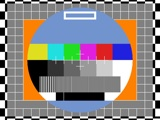
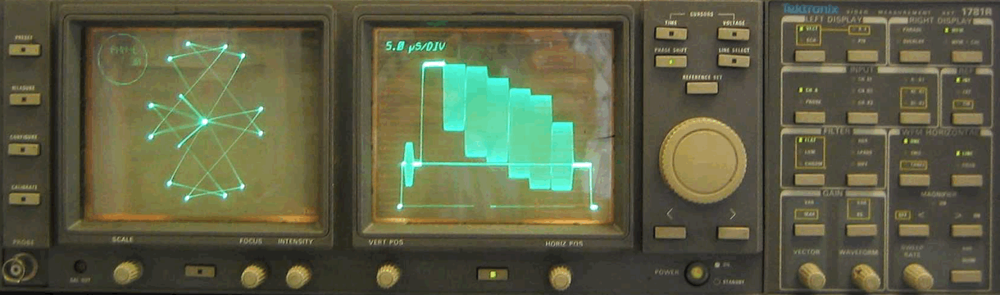

# First Post


<a id="toc"></a>
[Resources](#Resources) |  

Firstly, a compendium of composition elements:

# Heading H1 <a id="linkHeadings"></a>[▴](#toc)
## Heading H2
### Heading H3
#### Heading H4
##### Heading H5
###### Heading H6

## Links  <a id="linkTables"></a>[▴](#toc)


## Tables (extension)  <a id="linkTables"></a>[▴](#toc)

| Tables        | A             |       |
| ------------- |:-------------:| -----:|
| zebra stripes | alternate     |   120 |
| column 2      | centered      |  1230 |
| column 3      | ✓             |     1 |

## Paragraph <a id="linkParagraph"></a>[▴](#toc)

Lorem ipsum dolor sit amet, [test link: example.org](http://example.org/) adipiscing elit. Nullam dignissim convallis est. Quisque aliquam. Donec faucibus. Nunc iaculis suscipit dui. Nam sit amet sem. Aliquam libero nisi, imperdiet at, tincidunt nec, gravida vehicula, nisl. Praesent mattis, massa quis luctus fermentum, turpis mi volutpat justo, eu volutpat enim diam eget metus. Maecenas ornare tortor. Donec sed tellus eget sapien fringilla nonummy. Mauris a ante. Suspendisse quam sem, consequat at, commodo vitae, feugiat in, nunc. Morbi imperdiet augue quis tellus.

Lorem ipsum dolor sit amet, emphasis consectetuer adipiscing elit. Nullam dignissim convallis est. Quisque aliquam. Donec faucibus. Nunc iaculis suscipit dui. Nam sit amet sem. Aliquam libero nisi, imperdiet at, tincidunt nec, gravida vehicula, nisl. Praesent mattis, massa quis luctus ferment.

> "Details matter, it’s worth waiting to get it right." – Steve Jobs 

## List Types <a id="linkListTypes"></a>[▴](#toc)

**Ordered List**

1. List Item 1
2. List Item 2
3. List Item 3

**Unordered List**

* List Item 1
* List Item 2
* List Item 3

## Code <a id="linkCode"></a>[▴](#toc)

Example in bash `ls -al` code.

_C++_

``` cpp
a = b + 2*c
```

_HTML_

``` html
<a>The blue flower petals swayed back and forth in the wind.</span>
```

``` markup
<a>Mark my words …</span>
```

_Leaf Bracket Test Cases_

``` html
#if(count(xs) != 0) {{
	|x| = { x, if x >= 0; -x, otherwise; }

	Solve equations:
	#for(x in xs) {{
		|#(x)| = ?
	}}
}}
```

``` html
#for(user in users) {{
	Hello #(user.name)! :}
}}
```

``` html
#set("body") {{
<p>Two equations: \(A^T_S = B\) and \(\sqrt{ab}\).</p>
    <p>\[A^T_S = B\]  </p>
<p>\[\sqrt{ab}\]  </p>
}}
```

``` html
#if(foo) {{
   This is an example of broken javascript:
   var x = { }}
}}
```


## Images

_png_


_jpeg_




Broken Link


_pdf_


_gif_



_video_

## Math <a id="linkMath"></a>[▴](#toc)

Two equations: $A^T_S = B$ and $\sqrt{ab}$.

$$A^T_S = B$$  

$$\sqrt{ab}$$ 

#### The probability of getting `k` heads when flipping `n` coins is

Dollar syntax: $P(E) = {n \choose k} p^k (1-p)^{ n-k}$

$$P(E) = {n \choose k} p^k (1-p)^{ n-k}$$

Double backslash syntax: \\(P(E) = {n \choose k} p^k (1-p)^{ n-k} \\)

\\[P(E) = {n \choose k} p^k (1-p)^{ n-k} \\]

Single backslash syntax: \(P(E) = {n \choose k} p^k (1-p)^{ n-k} \)

\[P(E) = {n \choose k} p^k (1-p)^{ n-k} \]

#### Maxwell’s Equations

$$  \begin{aligned}
\nabla \times \vec{\mathbf{B}} -\, \frac1c\, \frac{\partial\vec{\mathbf{E}}}{\partial t} & = \frac{4\pi}{c}\vec{\mathbf{j}} \\   \nabla \cdot \vec{\mathbf{E}} & = 4 \pi \rho \\
\nabla \times \vec{\mathbf{E}}\, +\, \frac1c\, \frac{\partial\vec{\mathbf{B}}}{\partial t} & = \vec{\mathbf{0}} \\
\nabla \cdot \vec{\mathbf{B}} & = 0 \end{aligned}
$$

Note: LaTeX inline `\(...\)`, LaTeX display `\[...\]`, TeX shorthand inline `$...$`, TeX shorthand display `$$...$$`.

## Resources <a id="Resources"></a>[▴](#toc)

* [Related ⇗]()

Date Created: 2018.11.22

